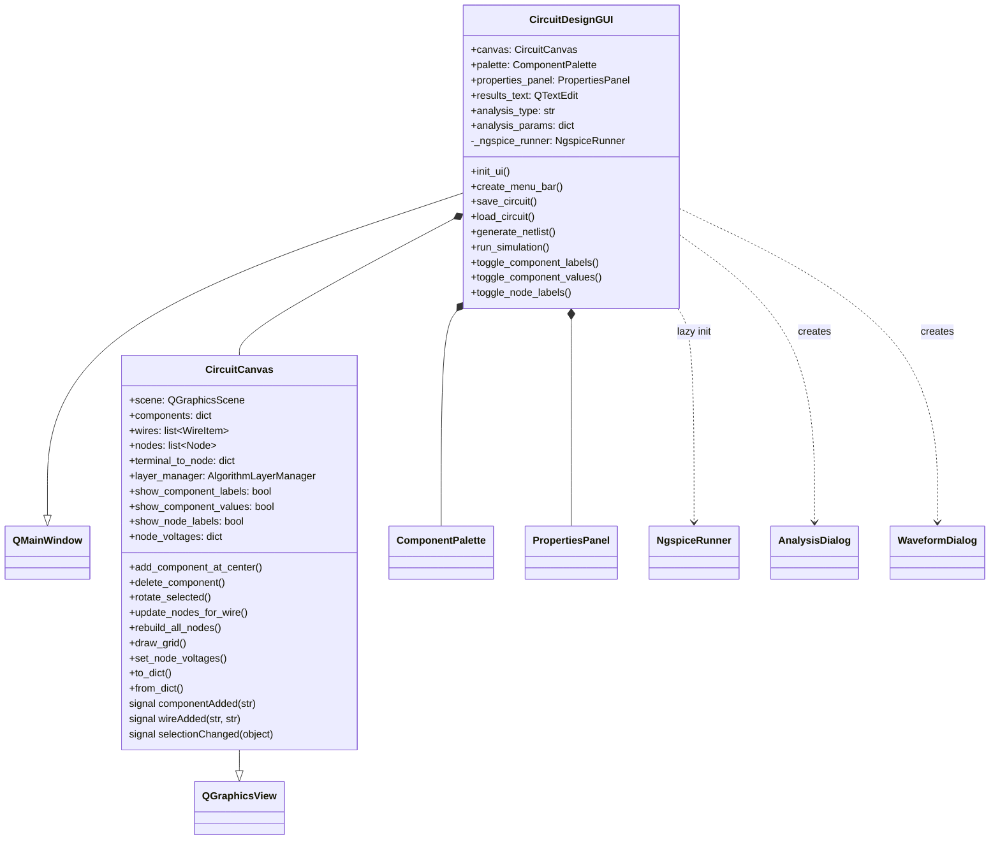
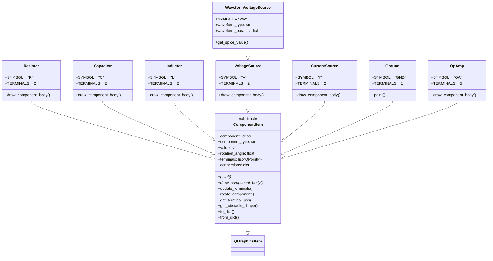
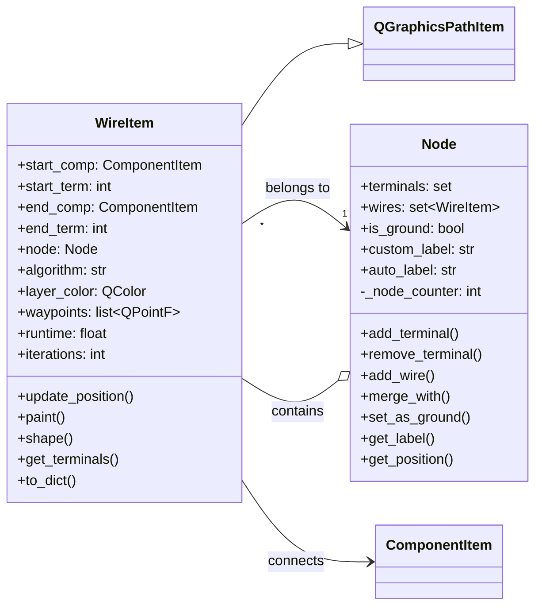
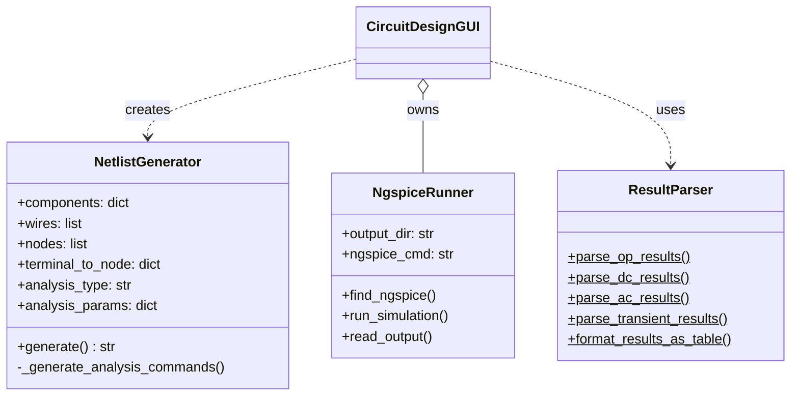
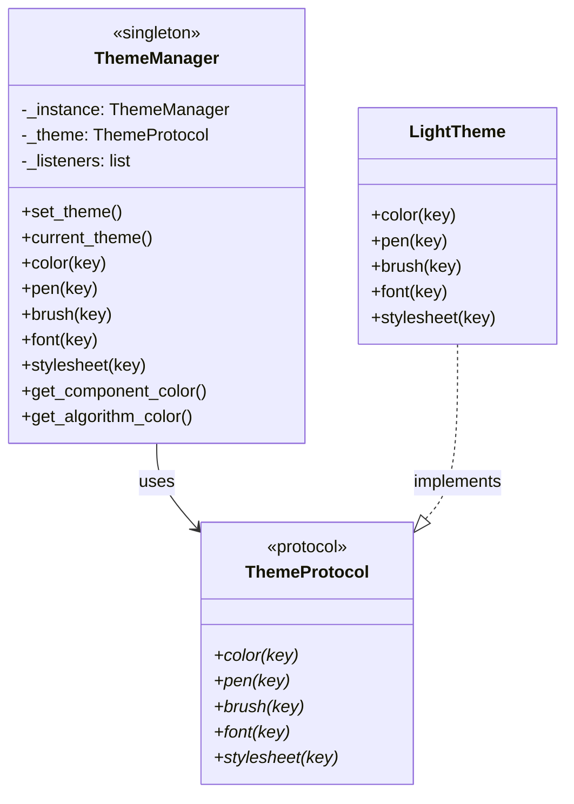
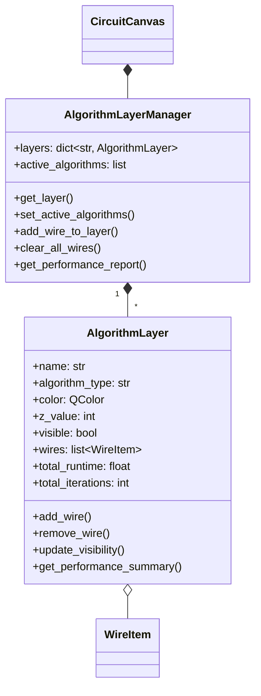
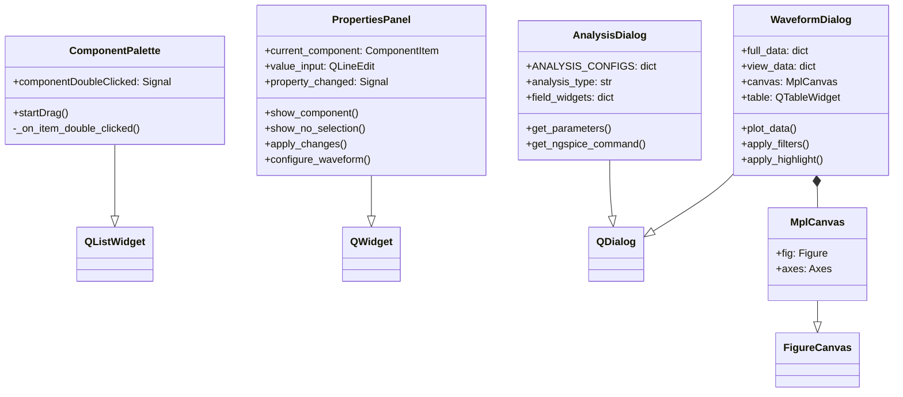
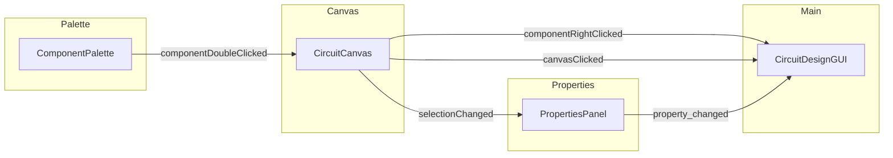
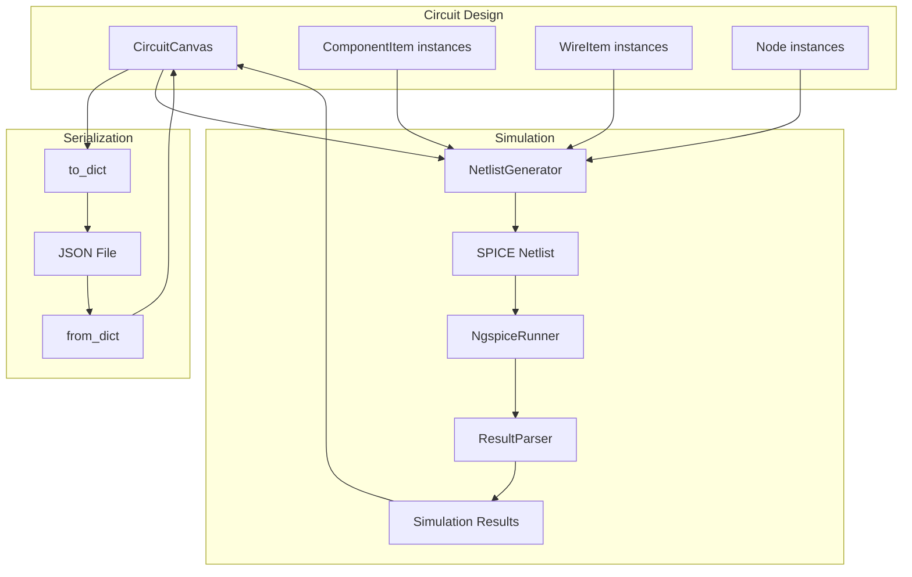

# SDM Spice Class Diagram

## Main Architecture

## Component Hierarchy

## Wire and Node System

## Simulation Classes

## Theme System

## Algorithm Layer System

## UI Widgets

## Signal Flow

## Data Flow

